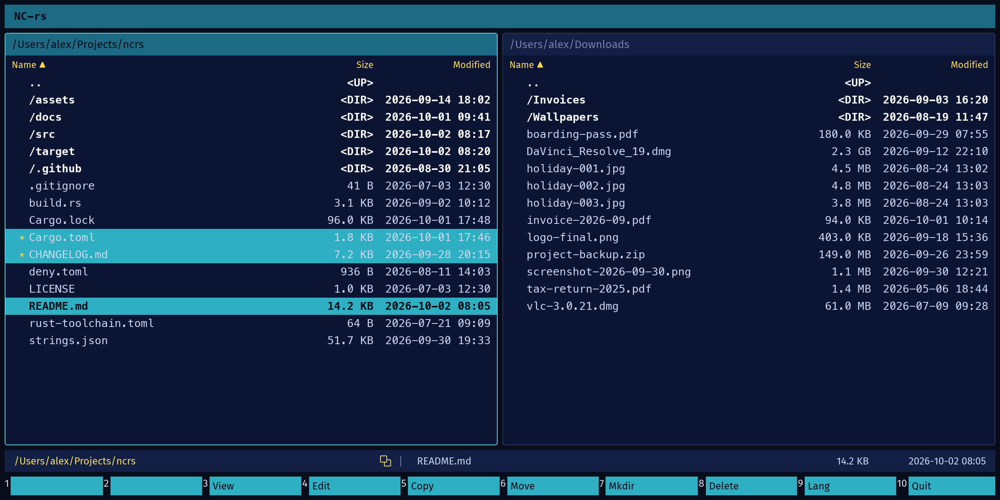
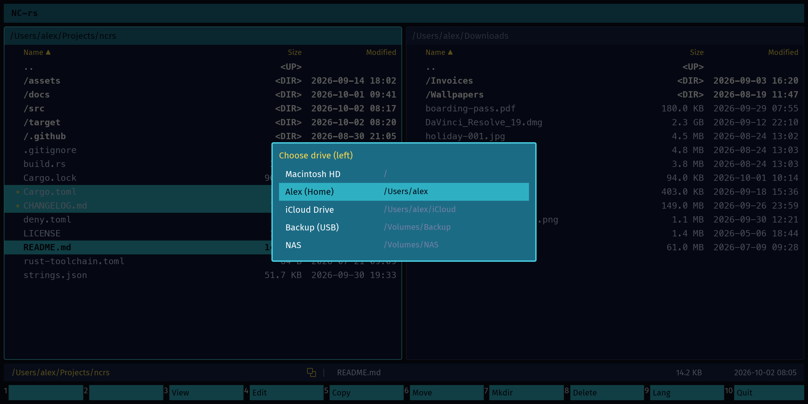
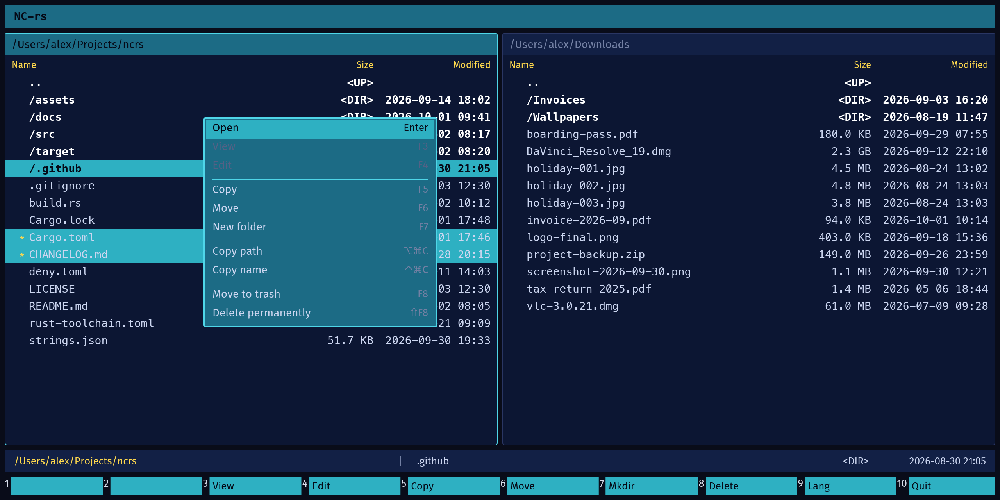
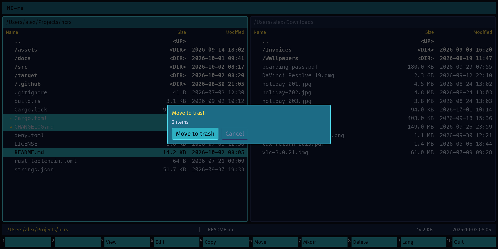
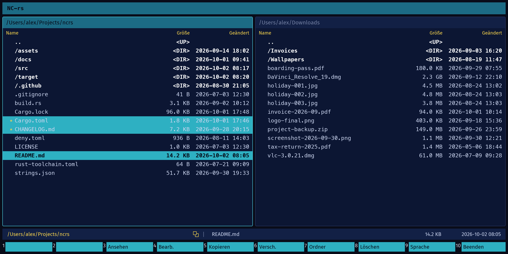

# NC-rs

[](https://github.com/CosmicDriftGameStudio/ncrs/actions/workflows/ci.yml)
[](https://github.com/CosmicDriftGameStudio/ncrs/releases/latest)
[](LICENSE)
[](rust-toolchain.toml)

A fast, keyboard-first **dual-panel file manager inspired by Norton Commander**, written in Rust
with [iced](https://iced.rs) 0.14 (GPU-accelerated, cross-platform native UI).



The architecture follows the principles of editors like Zed: async I/O, message-driven
state, pure views, and a strict separation between UI components, filesystem layer and
application state.

This is a **work in progress**. The dual-panel navigator works, localization with
per-string translator context works. File operations, archive support, network mounts,
configurable keymap and theming are planned but not built — see [ROADMAP.md](ROADMAP.md)
for the state, the licensing audit and the reasoning behind the order.

## Screenshots



The drive menu (`Alt+F1` for the left panel, `Alt+F2` for the right).



The context menu: right-click a row (`Ctrl`+click on a Mac), tap `Option` on its
own, or press `Shift`+`F10`. It acts on the tagged rows, else the cursor row.



F8 asks before it moves the tagged rows to the trash.



The same window in German, switched with F9.

## Features

- Two side-by-side file panels (left starts in the working directory, or `$HOME` when launched from Finder; right at `$HOME`)
- Multi-selection: tag rows with `Insert` or `Space` (or `Shift`+`Up`/`Down`, or Cmd/Ctrl-click), an operation applies to the tagged rows, or to
  the single row under the cursor when nothing is tagged
- Keyboard navigation, selection highlighting, auto-scrolling
- Name / Size / Modified columns, directories first, case-insensitive sort
- `..` entry to go up; the directory you came from is re-selected
- Async directory loading (tokio blocking pool) – the UI never blocks
- Stale-result protection (fast navigation cannot show an outdated listing)
- Errors (e.g. *Permission denied*) are shown in the status bar – no panics
- Mouse click selects a row and activates its panel; the wheel and the trackpad scroll the panel under the pointer
- Drive menu (`Alt`+`F1` / `Alt`+`F2`): jump a panel to the system volume, home, iCloud Drive (macOS),
  mounted volumes or drive letters, the same places as in the Finder sidebar
- Localized UI (English/German) with a translator note on every string, so the UI can
  be translated mechanically without reading the code
- Runs on Linux, macOS and Windows

## Keyboard shortcuts

| Key                | Action                                   |
|--------------------|------------------------------------------|
| `↑` / `↓`          | Move selection                           |
| `PgUp` / `PgDn`    | Move selection by one page (`Fn`+`↑`/`↓` on a Mac)  |
| `Cmd`+`↑` / `Cmd`+`↓` | Page up / down (`Ctrl` on Linux and Windows) |
| `Home` / `End`     | First / last entry                       |
| `Enter`            | Open directory (files: placeholder)      |
| `Insert` / `Space` | Tag / untag the row, move down one      |
| `Shift`+`Up`/`Down`| Tag / untag the row, move up / down     |
| `*`                | Tag every row (except `..`)             |
| `Ctrl`+`*`         | Clear all tags                          |
| `Option`+`Cmd`+`C` / `Ctrl`+`Alt`+`C` | Copy the path of the tagged rows (else the cursor row) to the clipboard |
| `Ctrl`+`Cmd`+`C` / `Ctrl`+`Shift`+`C` | Copy the name of the tagged rows (else the cursor row) to the clipboard |
| `F3` / `F4`        | View / edit the file under the cursor in an external program |
| `F5` / `F6`        | Copy / move to the other panel          |
| `F7`               | Create directory                        |
| `F8`               | Delete to the trash, after a confirmation |
| `Shift`+`F8`       | Delete permanently (`Enter` cancels; `Shift`+`F8` again confirms) |
| `Alt`+`F1` / `Alt`+`F2` | Drive menu for the left / right panel (`↑`/`↓`, `Home`/`End`, `Enter` goes, `Esc` closes; `Option` on macOS) |
| Right click / `Shift`+`F10` / `Option` tapped alone | Context menu at the pointer or the cursor row (`↑`/`↓`, `Home`/`End`, `Enter` runs, `Esc` closes; `Ctrl`+click also on a Mac) |
| `Backspace`        | Go to parent directory                   |
| `Tab`              | Switch active panel                      |
| `F9`               | Switch language (en/de, temporary)        |
| `F10` / `Q`        | Quit                                     |

## Install

Pre-built binaries for Linux, macOS and Windows are attached to each
[release](../../releases). On Linux and macOS:

```bash
curl -fsSL https://raw.githubusercontent.com/CosmicDriftGameStudio/ncrs/main/install.sh | sh
```

On macOS, Homebrew is the better choice: it installs `ncrs.app` into
Applications (Launchpad, Dock, Spotlight) and puts `ncrs` on your `PATH`:

```bash
brew install --cask cosmicdriftgamestudio/ncrs/ncrs
```

The cask lives in the tap
[`CosmicDriftGameStudio/homebrew-ncrs`](https://github.com/CosmicDriftGameStudio/homebrew-ncrs).
It is not in homebrew-cask upstream.

Started from Finder, the Dock or Launchpad, the left panel opens in `$HOME`
instead of `/`. From a terminal it still opens in the working directory.

`install.sh` installs into `~/.local/bin`, verifies the download checksum,
needs no `sudo`, and is safe to re-run. Remove it again with:

```bash
curl -fsSL https://raw.githubusercontent.com/CosmicDriftGameStudio/ncrs/main/install.sh | sh -s -- --uninstall
```

Set `NCRS_BIN_DIR` to install elsewhere, or `NCRS_REPO` if you fork it.

On Windows (PowerShell):

```powershell
irm https://raw.githubusercontent.com/CosmicDriftGameStudio/ncrs/main/install.ps1 | iex
```

## Graphics backend

The renderer is chosen by cargo features, not in code — `src/main.rs` contains no
renderer reference at all, which makes it easy to change by accident. Three
configurations:

| Build | Backend | Use it when |
|---|---|---|
| `cargo run` (default) | tiny-skia, software | CI, VMs, machines without a GPU. Measured: visibly laggy on a high-resolution display. |
| `--features gpu-rendering` | wgpu, GPU | Desktop only. Needs Vulkan/Metal/DX11, no software fallback. Add `--no-default-features`, otherwise the default feature is still on and you get the fallback renderer. |
| `--features gpu-with-fallback` | wgpu, falling back to tiny-skia | **Releases.** Fast where a GPU exists, still starts where it does not. |

Measured on a high-resolution display: software rendering took about a second to move the
highlighted row; the fallback build was immediate. The default stays software so that a
build without a GPU still works, and release builds pass `--features gpu-with-fallback`.

A debug build prints the backend at startup, and `src/backend.rs` holds the test
that pins it to the build configuration.

```bash
cargo build --features gpu-with-fallback --release
```

## Tests

```bash
cargo test                                      # 85 tests
cargo test --features gpu-with-fallback        # the release backend
```

Three layers, and they cover different things:

| Layer | What it covers | Where |
|---|---|---|
| Filesystem, state, routing, selection | what the app *decides* | `src/fs/`, `src/dialog.rs`, `src/selection.rs`, `app.rs` |
| UI, headless | what the user *sees* — clicks, rendering, layout | `src/ui_tests.rs` via `iced_test` |
| Snapshots | the images themselves | `tests/snapshots/` — **macOS only in CI** |

The snapshot tests run only where the reference images were produced. Font
rasterisation differs per operating system, so a macOS reference does not match
Windows output; the tests are skipped elsewhere rather than compared against a
reference that cannot hold.

The UI layer is [iced's own harness](https://docs.rs/iced_test): `Simulator` renders a
view headless and can click, type, tap keys and snapshot it. References in
`tests/snapshots/` are written on the first run and compared afterwards, so a layout
change shows up as a failing image.

Two limits of iced 0.14 worth knowing: `iced_selector` finds widgets by `widget::Id`, and
`Button` has no `id` method — so buttons are addressed by the position the layout reports
for them. And `Snapshot` offers no bytes, only a comparison against a file.

## Build & run

Requirements: Rust (stable, 1.80+) via [rustup](https://rustup.rs).

```bash
cargo run            # debug build
cargo run --release  # optimized build
cargo run --release --features gpu-with-fallback  # smooth on a high-resolution display
cargo test           # unit tests (fs reader, formatting, panel selection logic)
```

**Linux** additionally needs the usual windowing/font dev packages, e.g. on Debian/Ubuntu:

```bash
sudo apt install pkg-config libxkbcommon-dev libwayland-dev libx11-dev libfontconfig1-dev
```

macOS and Windows need no extra system packages.

## Architecture

```
src/
├── main.rs          # Entry point: iced::application builder (tokio executor)
├── app.rs           # App state, update() – the ONLY place state changes – and view()
├── selection.rs     # Tagged rows: the rule an operation applies to
├── dialog.rs        # State of the modal prompt (F7 and the operations after it)
├── messages.rs      # Central Message enum + PanelSide
├── keymap.rs        # Key press -> Message mapping, shortcut list for the header
├── ui/              # Pure, reusable view components (no business logic)
│   ├── panel.rs     # PanelState (data + selection/scroll helpers) + view()
│   ├── dialog.rs    # The prompt: text field, buttons, scrim
│   ├── header.rs    # Title bar with shortcut hints
│   ├── statusbar.rs # Active path | selected entry | size | date (or error)
│   ├── theme.rs     # Colors, spacing, font sizes, widget style functions
│   ├── layout.rs    # Fixed metrics (row height, column widths, visible rows)
│   └── format.rs    # Size / date formatting
├── i18n/            # Translated UI strings + per-string translator context
│   ├── mod.rs        # Msg enum, Language, Msg::note() (context for translators)
│   ├── lang/en.rs    # Source language
│   └── lang/de.rs    # German
└── fs/              # Filesystem layer – knows nothing about the UI
    ├── entry.rs     # FileEntry (name, path, size, modified, is_dir, ...) + sort order
    ├── ops.rs       # create_dir() and friends, structured errors, no text
    └── reader.rs    # async read_directory(), home_dir(), root_of()
```

### Data flow (Elm architecture)

```
 keyboard / mouse / window events
            │  (keymap::map_key, subscriptions)
            ▼
        Message ──► App::update(&mut self) ──► Task<Message> (async fs work)
            ▲                │                         │
            │                ▼                         │
            │          App::view(&self)                │
            │      (pure: state -> Element)            │
            └──────── Message::DirectoryLoaded ◄───────┘
```

### Principles

1. **No business logic in views.** `ui::*::view` functions take state and return
   `Element`s – nothing else.
2. **All state mutations go through messages.** `App::update` is the single place where
   state changes.
3. **Filesystem work is async.** `fs::read_directory` runs on tokio's blocking pool via
   `Task::perform`; results come back as `Message::DirectoryLoaded`.
4. **Components are functions, not stateful widgets.** `PanelState` lives in `App`;
   `panel::view` just renders it.
5. **Components are generic over the message type.** `panel::view` receives an
   `on_row_click: impl Fn(usize) -> M` callback, `header::view` / `statusbar::view` are
   generic `M` – they can be reused in any iced app or in other screens (dialogs, viewers…).
6. **Minimal exports.** `fs` re-exports only `FileEntry` and the reader functions; the UI
   module exposes components and `PanelState`/`PanelProps`.

### Localization

`strings.json` in the repository root is the **source of truth**. Per string it holds the
stable key, the English text, the German text and a `context` field: where the string
appears and what it means, written for someone working from that file alone — because
"Open" as a button label, as a menu entry and inside an error message are three
different strings.

`build.rs` generates the Rust modules from it, so text and context cannot drift apart.
It fails the build when a string has no usable context or is missing a translation.

```bash
# every string with its context and both translations, for a translator
cargo test dump -- --nocapture
```

Adding or changing a string:

1. Edit `strings.json`. `cargo build` regenerates the modules.
2. A new key becomes a `Msg` variant, so every call site that should use it is a
   compile error until updated.

Adding a language:

1. Add the language to `strings.json` and to `build.rs`'s language list.
2. Add the variant to `Language` and its lookup in `src/i18n/mod.rs`.
3. `cargo test` — placeholder mismatches and untranslated copies fail the build, not the
   UI. `<DIR>` and `<UP>` are deliberately never translated.

`<DIR>` and `<UP>` are deliberately never translated: they are a Norton Commander
convention, and the tests enforce it.

### Scrolling

Rows have a fixed height (`ui::layout::ROW_HEIGHT`). On window resize the app recomputes
`visible_rows`; each panel renders `entries[scroll_offset .. scroll_offset + visible_rows]`
and `PanelState::ensure_visible` keeps the selection on screen. This is O(visible rows)
per frame, independent of directory size.

## Extending NC-rs

### Add a keyboard shortcut / action

1. Add a variant to `Message` in `src/messages.rs`, e.g. `ToggleHidden`.
2. Map a key in `keymap::map_key` (`Key::Named(Named::F3) => Some(Message::View)`),
   optionally add it to `keymap::SHORTCUTS` so it shows up in the header.
3. Handle it in `App::update`. Keep the view untouched unless something new is displayed.

### Add a filesystem operation (copy, move, delete, mkdir …)

1. Implement it as an `async fn` in a new file under `src/fs/` (use
   `tokio::task::spawn_blocking` or `tokio::fs`), return a plain result type.
2. Re-export it from `src/fs/mod.rs`.
3. In `App::update`, start it with `Task::perform(fs::op(src, dst), |r| Message::OpDone(r))`.
   Use `active_panel()` for the source and `inactive_panel_mut()` for the target panel.
4. On completion, reload the affected panels with `App::load`.

### Add a UI component (dialog, file viewer, command line …)

1. Create `src/ui/<component>.rs` with a `pub fn view<'a, M: Clone + 'a>(…) -> Element<'a, M>`.
   Pass everything it needs as arguments (state refs, props struct, message callbacks).
2. Put its colors/styles into `ui/theme.rs` and fixed sizes into `ui/layout.rs`.
3. Keep its state (if any) as a field in `App` (e.g. `dialog: Option<DialogState>`) and
   compose it in `App::view` (e.g. with `iced::widget::stack` for overlays).

### Add a column (permissions, extension …)

1. Add the field to `FileEntry` and fill it in `FileEntry::from_dir_entry`.
2. Add a formatter to `ui/format.rs`, a width to `ui/layout.rs`, and the cell to
   `panel::column_header` / `panel::file_row`.

### Ideas for next steps

- Multi-selection (`Insert`), quick search by typing
- Filesystem watching (`notify` crate) as an iced `Subscription`
- Configurable keymap and theme (TOML)

## Tech notes

- Font: the built-in monospace font for an authentic commander look.
- The `advanced` iced feature is **not** enabled: the app uses no `pane_grid`, `tooltip`,
  `pick_list` or `text::Font` variant. Add it back in `Cargo.toml` when you reach for one
  of those.
- The compiler is pinned in `rust-toolchain.toml`, and that pin only takes effect
  under **rustup**. A Homebrew-installed Rust ignores the file, so a local
  `cargo test` can run a different compiler than CI. `thiserror` and `softbuffer`,
  both pulled in by iced, have each broken the build on a brand-new stable.

## Trademark

Norton Commander is a trademark of its respective owner. ncrs is not affiliated
with or endorsed by it.

## License

MIT

## Contributing, security, changes

- [CONTRIBUTING.md](CONTRIBUTING.md) — the rules the code follows, and how to
  verify a change
- [CHANGELOG.md](CHANGELOG.md) — what each release does, and what it does not
- [SECURITY.md](SECURITY.md) — how to report a vulnerability privately
- [ARCHITECTURE_REVIEW.md](ARCHITECTURE_REVIEW.md) — the state of the
  architecture, the numbered findings, and the order they are being fixed in
